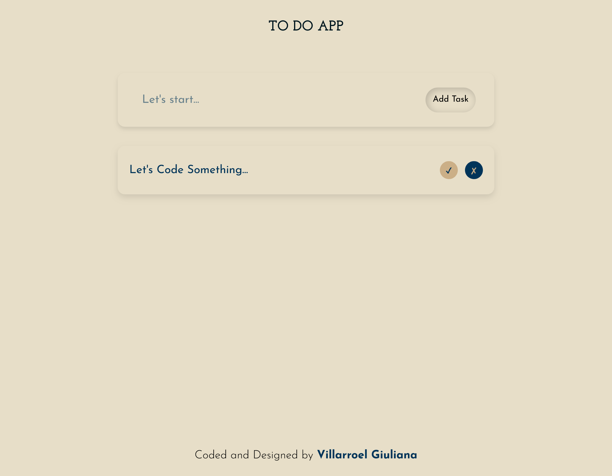

# 📝 ToDoApp

A task management web application (To-Do List) built with React and Vite. A modern and responsive interface with desktop-first design that allows you to organize your daily tasks efficiently.


## 🚀 Features

- ✅ Create, complete and delete tasks
- 🎨 Responsive design with desktop-first approach
- 🔤 Adaptive typography for better readability
- ♿ Semantic HTML for enhanced accessibility
- ⚡ Fast development with Vite HMR (Hot Module Replacement)
- 🎯 Intuitive and minimalist interface

## 🛠️ Technologies

- **React 18** - JavaScript library for building user interfaces
- **Vite** - Build tool and development server
- **JavaScript (ES6+)** - Programming language
- **CSS3** - Styling and responsive design
- **ESLint** - Linter to maintain code quality

## 📋 Prerequisites

Make sure you have installed:

- [Node.js](https://nodejs.org/) (version 14.0 or higher)
- npm or yarn

## 🔧 Installation

1. **Clone the repository**

```bash
git clone https://github.com/gvillarroel-dev/toDoApp.git
cd toDoApp
```

2. **Install dependencies**

```bash
npm install
```

3. **Start development server**

```bash
npm run dev
```

4. **Open in browser**

```
http://localhost:5173
```

## 📦 Available Scripts

```bash
npm run dev      # Start development server
npm run build    # Generate production build
npm run preview  # Preview production build
npm run lint     # Run ESLint to check code
```

## 🎨 Design Features

### Desktop-First

The application is initially designed for desktop screens and then adapts to smaller devices using media queries.

### Responsive Design

The design fluidly adjusts to different screen sizes, ensuring an optimal experience on desktop, tablet, and mobile.

### Adaptive Typography

Fonts use relative units (rem, em) and modern CSS functions like `clamp()` to scale appropriately across devices.

### Semantic HTML

Implementation of semantic HTML5 tags that improve accessibility and SEO.

## 🔑 Features

### ➕ Add Tasks

Type your task name in the input field and press "Enter" or click the "Add" button to create a new task.

### ✔️ Complete Tasks

Mark a task as completed by clicking the checkbox next to it. Completed tasks will display with a different style.

### 🗑️ Delete Tasks

Remove tasks you no longer need by clicking the delete button associated with each task.

## 🚀 Deployment

### Production Build

To generate optimized files for production:

```bash
npm run build
```

The generated files will be in the `dist/` folder and ready to be deployed.

### Hosting Options

You can deploy this application on:

- [Vercel](https://vercel.com/)
- [Netlify](https://www.netlify.com/)
- [GitHub Pages](https://pages.github.com/)
- [Render](https://render.com/)

## 🤝 Contributing

Contributions are welcome. If you wish to contribute:

1. Fork the project
2. Create a feature branch (`git checkout -b feature/new-feature`)
3. Commit your changes (`git commit -m 'feat: add new feature'`)
4. Push to the branch (`git push origin feature/new-feature`)
5. Open a Pull Request

## 👤 Author

**gvillarroel-dev**

- GitHub: [@gvillarroel-dev](https://github.com/gvillarroel-dev)

## 🙏 Acknowledgments

- React team for the excellent documentation
- Vite team for the incredible development tool
- Open source community

---

⭐ If you find this project useful, consider giving it a star on GitHub
